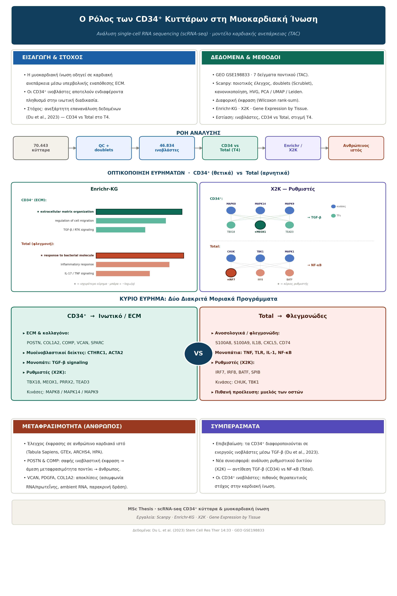

# MSC_thesis_Mitropolitiko
# 🫀 scRNA-seq Analysis of CD34⁺ Cells in Myocardial Fibrosis

> Independent re-analysis of single-cell RNA sequencing data investigating the role of **CD34⁺ fibroblasts** in myocardial fibrosis during heart failure.



---

## 📌 Overview

This project re-analyzes the single-cell RNA sequencing (scRNA-seq) dataset **GSE198833** (Du et al., 2023) to characterize the transcriptional program of CD34⁺ fibroblasts in cardiac fibrosis. The analysis focuses on the comparison between the **CD34-enriched** and the **total (Total)** fibroblast population at the early stage of heart failure (**T4**, four weeks post-TAC).

**Central finding:** CD34⁺ fibroblasts exhibit a distinct **extracellular matrix (ECM) / fibrotic program** driven by **TGF-β signaling**, in clear contrast to the **inflammatory (NF-κB) profile** of the total population.

---

## 📥 Data Availability

> **[The raw data are publicly available.
Download link:https://www.ncbi.nlm.nih.gov/geo/query/acc.cgi?acc=GSE198833 and put in destination file "../data/GSE198833_RAW".
> Next run the procedure "/scripts/Data_Overview_2.ipynd" to create combined_heart_failure_adata.h5ad to use in final analysis.
]**


## 🔬 Dataset

| | |
|---|---|
| **Source** | GEO GSE198833 |
| **Reference study** | Du L. et al. (2023), *Stem Cell Research & Therapy* 14:33 |
| **Model** | Mouse · transverse aortic constriction (TAC) |
| **Samples** | 7 samples (CD34 & Total phenotypes) |
| **Timepoints** | T0 · T4 · T12 (focus on **T4**) |

---

## ⚙️ Analysis Workflow

| # | Step | Tool |
|---|------|------|
| 1 | Loading & quality control (filtering, mito <10%) | **Scanpy** |
| 2 | Doublet detection & removal | **Scrublet** |
| 3 | Normalization · log1p · HVG · scaling | **Scanpy** |
| 4 | Dimensionality reduction & clustering (PCA · UMAP · Leiden) | **Scanpy** |
| 5 | Cell-type identification (marker genes) | Dcn, Ddr2, Cdh5, Kdr … |
| 6 | Differential expression (CD34 vs Total, T4) | **Scanpy** (Wilcoxon) |
| 7 | Functional enrichment | **Enrichr-KG** |
| 8 | Upstream regulatory network | **X2K** (ChEA3 · KEA3) |
| 9 | Human tissue translatability | **Gene Expression by Tissue** |

**Pipeline:** `70,443 cells → QC + doublets → 59,377 cells → 5 cell types → 46,834 fibroblasts → CD34 vs Total (T4) → enrichment → regulators → human validation`

---

## 🧬 Key Findings

### CD34⁺ → Fibrotic / ECM program
- **ECM & collagen:** POSTN, COL1A2, COMP, VCAN, SPARC, COL14A1
- **Myofibroblast markers:** CTHRC1, ACTA2
- **Pathway:** TGF-β signaling
- **Regulators (X2K):** TBX18, MEOX1, PRRX2, TEAD3 · Kinases: MAPK8/14/9

### Total → Inflammatory program
- **Immune / inflammatory:** S100A8, S100A9, IL1B, CXCL5, CD74
- **Pathways:** TNF · TLR · IL-1 · NF-κB
- **Regulators (X2K):** IRF7, IRF8, BATF, SPIB · Kinases: CHUK, TBK1

### Human translatability
- **POSTN & COMP** → clear fibroblast-specific expression (direct mouse→human translatability)
- **VCAN, PDGFA, COL1A2** → divergent patterns (RNA/protein discordance, ambient RNA, paracrine signaling)

---

## 🛠️ Requirements

```bash
pip install scanpy scrublet numpy pandas matplotlib igraph leidenalg
```

**Enrichment / regulatory analyses** were performed using the Ma'ayan Lab web tools:
- [Enrichr-KG](https://maayanlab.cloud/enrichr-kg)
- [X2K](https://maayanlab.cloud/X2K/)
- [Gene Expression by Tissue](https://appyters.maayanlab.cloud/#/Gene_Expression_by_Tissue)

---

## ▶️ How to Run

1. Download the dataset (see **Data Availability** above) and place it in the project folder.
2. Install the required packages (see **Requirements**).
3. Open and run the notebook:
  ```bash
   jupyter lab Data_Overview-2.ipynb
   ```
   ```bash
   jupyter lab scRNAseq_CD34_analysis.ipynb
   ```
4. Run the cells sequentially from top to bottom.

---

## 📂 Repository Structure

```
├── script                          # Clear-Merge data and Main analysis notebook
├── images                          #Poster,Grapghs
├── requirements.txt                # Python dependencies
└── README.md
```

---

## 📖 Reference

Du L., Sun X., Gong H., et al. (2023). *Single cell and lineage tracing studies reveal the impact of CD34⁺ cells on myocardial fibrosis during heart failure.* **Stem Cell Research & Therapy** 14:33. doi:10.1186/s13287-023-03256-0

---

*MSc Thesis · scRNA-seq of CD34⁺ cells in myocardial fibrosis*
